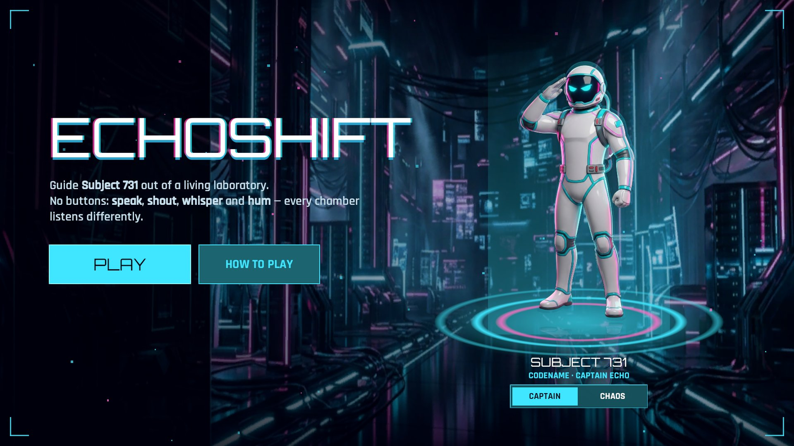
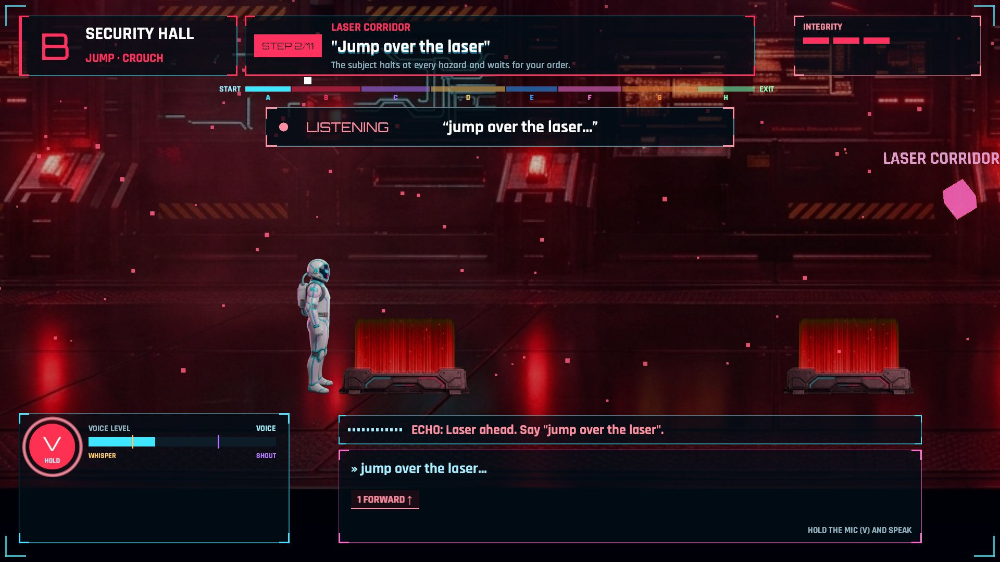
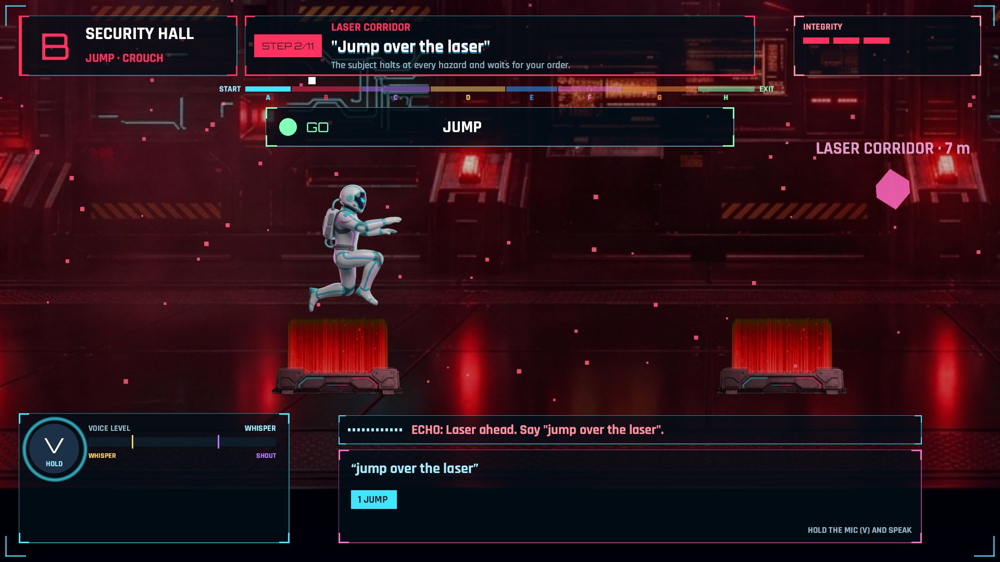
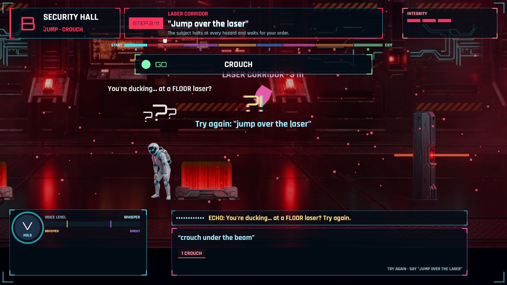
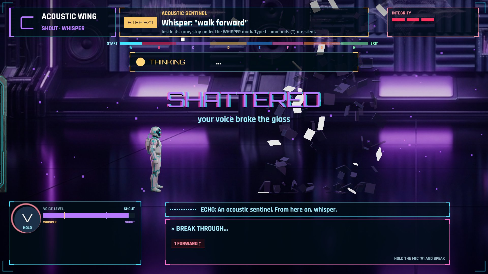
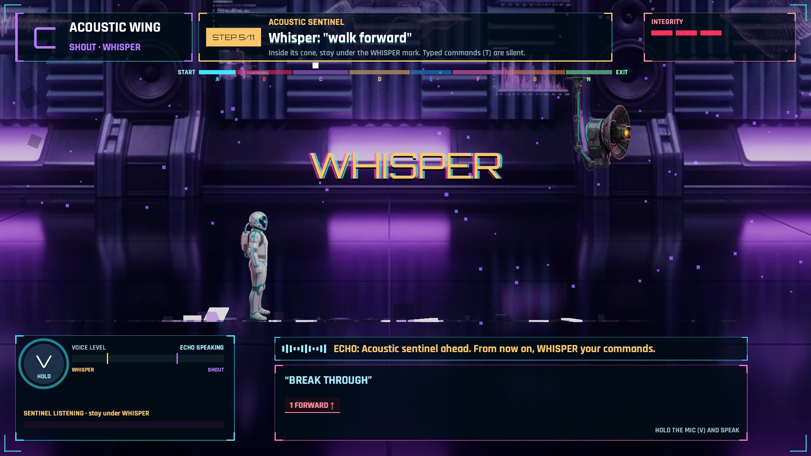
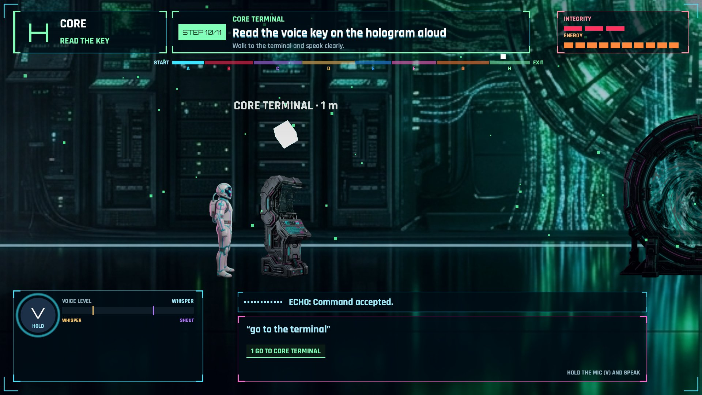
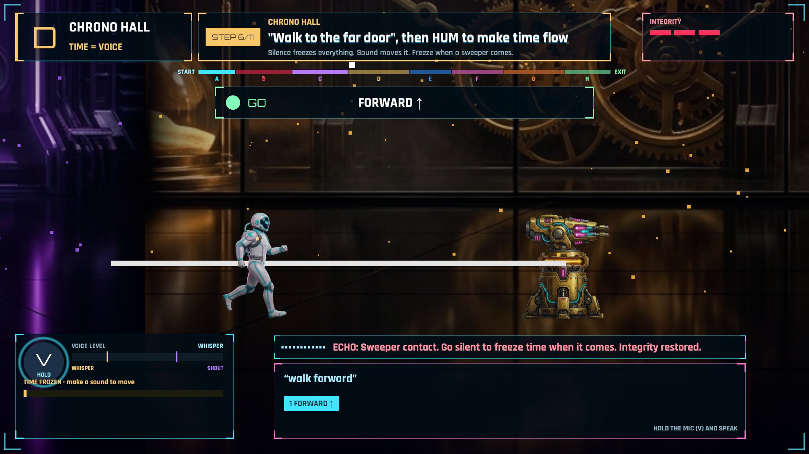
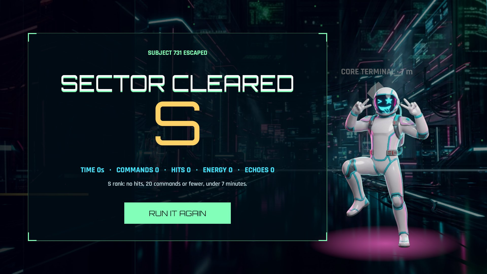

# EchoShift Lab

**A voice-controlled platform game.** You guide *Subject 731*, a robot trapped inside a laboratory, by talking to it:
speak to move, shout to break glass, whisper to pass acoustic sensors, hum to unlock doors, and use spoken commands to
solve each room. Every chamber listens to your voice in a different way.



---

## Demo

The screenshots below are captured from the game. The voice input can be simulated by the autotest system, using the same
listening card, word-by-word transcription, and volume meter as a real microphone session.

**1. You speak** - the **LISTENING** card appears, the phrase is transcribed live, and the volume meter reacts.



**2. The robot acts** - the command is understood instantly, without AI latency: **GO > JUMP**, and the robot jumps the laser.



**3. A bad command** - saying "crouch under the beam" in front of a floor laser makes the robot stop and question the order.



| **4. Shout** - shouting "BREAK THROUGH!" pushes the meter above SHOUT and shatters sonic glass. | **5. Whisper** - near the acoustic sentinel, your voice must stay below the WHISPER mark. |
|---|---|
|  |  |
| **6. Complex command** - "go to the terminal" goes through Gemini, which returns *GO TO CORE TERMINAL*. | **7. Voice controls time** - in Chrono Hall, the world moves only while you make sound. |
|  |  |

**8. Victory** - final rank is S/A/B/C based on time, command count, and damage taken.



---

## Table of Contents

1. [The Game](#1-the-game)
2. [How It Works](#2-how-it-works)
3. [AI Engineering Highlights](#3-ai-engineering-highlights)
4. [AI Services](#4-ai-services)
5. [Project Structure](#5-project-structure)
6. [Setup and Launch](#6-setup-and-launch)
7. [Controls](#7-controls)
8. [Generate Images](#8-generate-images)
9. [Tests](#9-tests)
10. [Configuration](#10-configuration)
11. [Troubleshooting](#11-troubleshooting)

---

## 1. The Game

The game uses a **side-view platformer** camera. Rooms, props, obstacles, and robot poses are generated AI images
(Google Gemini image generation, also referred to in the project as Nano Banana) and are kept consistent with the home
screen art direction.

The *Sector 01* level has **8 rooms**, each built around a voice mechanic:

| Room | Name | Voice mechanic |
|---|---|---|
| **A** | Airlock | Speak normally, such as "walk forward". ECHO learns your normal voice level. |
| **B** | Security Hall | Say "jump over the laser" or "crouch under the beam". |
| **C** | Acoustic Wing | **Shout** to break sonic glass, then **whisper** past the sentinel. |
| **D** | Chrono Hall | **Voice controls time**: sound makes the world move, silence freezes it. |
| **E** | Resonance Vault | **Hum** a note to tune the lock, then match low / mid / high tones. |
| **F** | Echo Chamber | Say "echo" to create a clone that replays your path and holds a pressure plate. |
| **G** | Architect Forge | **Build with words**: "build a bridge of ice over the gap", "build stairs". |
| **H** | Core | Read the terminal key aloud, then enter the portal. |

At the end, you receive an **S / A / B / C** rank based on time, number of commands, and damage.

The robot does not blindly run into hazards. It stops at obstacles, and ECHO, the lab AI, tells you what is needed.
If you give an impossible command, the robot reacts instead of executing it.

---

## 2. How It Works

```text
 microphone --> VoiceInput (Unity) --> volume + pitch --> shout / whisper / hum / time
      |
      +--> SttSession --> backend /ws/stt --> Gradium speech-to-text
                                               |
                                               v
                                          transcription
                                               |
                 +-----------------------------+-----------------------------+
                 v                                                           v
 simple command ("walk forward",                            complex command ("go to the glass",
 "jump", "crouch", "shout")                                 "build a bridge of ice")
 QuickIntent.cs, instant, no AI                             backend /api/interpret --> Gemini
                 |                                                           |
                 +------------------------> action list <---------------------+
                                               |
                                               v
                                CommandExecutor --> robot acts
                                               |
                                               v
                         ECHO replies --> backend /ws/tts --> Gradium text-to-speech
```

Important points:

- **The game engine decides, not the AI.** Gemini proposes actions; the engine validates collisions, hazards, and room rules
  before executing anything.
- **Simple commands do not go through Gemini.** Unity handles them directly for instant response.
- **Volume and pitch are measured by the game**, not guessed by AI. They are used to break glass, trigger sentinels, move
  time, and open the vault.
- Holding `V` makes ECHO stop talking immediately, so the player can interrupt it.
- A status card always shows the current state: **LISTENING** -> **THINKING** -> **GO**.

---

## 3. AI Engineering Highlights

EchoShift Lab is built as an **AI engineering system**, not as a model-training demo. The core challenge is connecting
real-time voice input, LLM reasoning, structured outputs, validation, and game execution without letting the model take
unsafe or impossible actions.

For a detailed French technical explanation of the AI pipeline, STT, TTS, QuickIntent, Gemini intent parsing, and
validation flow, see [docs/AI_TECHNICAL_OVERVIEW.fr.md](docs/AI_TECHNICAL_OVERVIEW.fr.md).

### Real-time voice-to-action pipeline

The player speaks naturally. Unity streams audio to the backend, Gradium converts speech to text, and the transcript is
either parsed locally for simple commands or sent to Gemini for complex intent parsing.

```text
voice audio
  -> Gradium STT
  -> transcript
  -> QuickIntent or Gemini
  -> structured JSON actions
  -> backend validation
  -> Unity CommandExecutor
  -> gameplay result
```

This keeps the player experience responsive while still supporting flexible natural language.

### Structured LLM output

Gemini does not return free-form text for gameplay. It must produce JSON matching the backend schema:

- `IntentResponse`: confidence, clarification flag, optional ECHO reply, and action list.
- `GameAction`: action type, target, speed, distance, duration, build kind, and material.
- `ActionType`: a closed set of allowed actions such as `MOVE_TO`, `JUMP_OVER`, `INTERACT`, `BUILD`, `ECHO`, and `STOP`.

That makes the LLM output machine-readable, testable, and safe to validate before it reaches the Unity runtime.

### Guardrails and game authority

The LLM proposes intent; it never directly controls the character. The backend validates every action against the current
world state:

- unknown or invisible targets are rejected;
- unsupported action types are ignored;
- vague autopilot requests such as "solve the level" require clarification;
- low-confidence or empty outputs do not execute;
- emergency commands like `stop`, `wait`, or `cancel` bypass the model and immediately produce a `STOP` action.

Unity remains the source of truth for physics, collisions, hazards, room rules, and whether an action can actually happen.

### Latency strategy

Everyday commands are parsed on-device in Unity by `QuickIntent.cs`, so they do not wait for a network round trip:

- `walk forward`
- `jump`
- `crouch`
- `turn around`
- `shout`

Only object-aware or multi-step commands go to Gemini, for example `go to the terminal and activate it` or
`build a bridge of ice over the gap`.

### Robust fallback behavior

If Gemini is unavailable, the backend falls back to a deterministic rule-based parser. The game can still understand basic
movement, hazards, terminal interaction, and stop commands. This makes the system testable in CI and playable without a
full AI setup.

### Multimodal AI use

The project also uses Gemini image generation for game art: room backgrounds, robot poses, props, materials, and textures.
Generated images are cached and copied into Unity resources so the runtime does not depend on image generation latency.

### What this demonstrates

From an AI/ML engineering perspective, the project demonstrates:

- speech-to-text integration in a real-time interactive loop;
- LLM-based intent parsing with strict structured output;
- schema validation and guardrails around model predictions;
- hybrid local/remote inference for latency control;
- fallback logic when model calls fail;
- multimodal asset generation with caching;
- separation of API keys and model calls into a backend service.

---

## 4. AI Services

All AI calls go through the **Python backend**. API keys are never stored inside the Unity client.

| Role | Service | Code |
|---|---|---|
| Live speech-to-text | **Gradium** STT | `backend/audio/gradium_stt.py`, `/ws/stt` |
| Complex command parsing | **Google Gemini** structured JSON | `backend/ai/intent_parser.py`, `/api/interpret` |
| ECHO voice | **Gradium** TTS | `backend/audio/gradium_tts.py`, `/ws/tts` |
| Game images | **Gemini Image / Nano Banana** | `backend/ai/design_assets.py`, `/api/design/*` |
| Voice-built object textures | **Nano Banana** | `/api/design/texture` |

Without a Gemini key, the backend uses `local_fallback_parse` so tests and basic commands still work.
The rules given to Gemini are documented in [docs/MODEL_RULES.md](docs/MODEL_RULES.md).

---

## 5. Project Structure

```text
game/
+-- backend/                 Python server: AI, voice, image generation
|   +-- app.py               Entry point, CORS, static /assets hosting
|   +-- config.py            Reads backend/.env
|   +-- ai/
|   |   +-- intent_parser.py Gemini: transcript -> structured actions + fallback parser
|   |   +-- model_rules.py   System instructions for Gemini
|   |   +-- schemas.py       Pydantic response schemas
|   |   +-- echo_agent.py    ECHO lines
|   |   +-- design_assets.py Image prompts and cache generation
|   +-- audio/               Gradium bridge: STT and TTS
|   +-- game/                Action schemas and validators
|   +-- routes/              intent.py, voice.py, design.py, session.py
|   +-- assets/              Generated image cache
|   +-- tests/               Pytest coverage for intent parsing
|
+-- unity/EchoShift3D/       Unity 6 URP game project
|   +-- Assets/EchoShift/
|       +-- Scripts/         Gameplay, voice, level, UI, camera, networking
|       +-- Resources/Game/  Embedded game art (*.bytes)
|       +-- Resources/Images Home screen and robot art
|       +-- Resources/Fonts  Orbitron and Rajdhani
|       +-- Editor/ProjectSetup.cs
|
+-- docs/                    AI rules and README screenshots
```

### Unity Scripts

The game is assembled by code. `Main.unity` contains a minimal scene, and `GameDirector` builds the playable flow.

| Folder | Key files | Role |
|---|---|---|
| `Core/` | `GameDirector.cs` | Main orchestrator: title, intro, voice pipeline, room goals, damage, hints, victory, autotest. |
| | `Config.cs` | Backend URL from `-backend`, `ECHOSHIFT_BACKEND`, or `Resources/backend_url.txt`. |
| | `Mats.cs`, `Prims.cs`, `Tween.cs`, `Sfx.cs`, `Json.cs`, `MainThread.cs` | Materials, primitives, animation, sound, JSON, main-thread dispatch. |
| `Voice/` | `VoiceInput.cs` | Always-on microphone: volume, pitch, whisper/shout thresholds, audio streaming. |
| | `SttSession.cs` | Streams one phrase to `/ws/stt` after releasing `V`. |
| | `EchoSpeaker.cs`, `PitchDetector.cs` | ECHO text-to-speech and pitch detection. |
| `Gameplay/` | `QuickIntent.cs` | Instant parsing for simple commands without AI. |
| | `CommandExecutor.cs` | Executes actions step by step. |
| | `Subject.cs`, `SubjectRig.cs`, `RobotSprite.cs` | Robot physics, rig, and generated pose sprites. |
| | `GameAction.cs`, `WorldEntity.cs` | Action format and named world objects. |
| `Level/` | `Facility.cs` | Builds the 8 rooms, obstacles, and collisions. |
| | `SideView.cs` | Side-view room backgrounds, props, and effects. |
| | `LaserGate`, `SonicGlass`, `Sentinel`, `ChronoSweeper`, `ResonanceVault`, `PressurePlate`, `SlidingDoor`, `CoreTerminal`, `ExitPortal` | One script per room mechanic. |
| `Innovations/` | `VoiceTime.cs`, `EchoRecorder.cs`, `EchoClone.cs`, `WordForge.cs` | Voice time, echo clones, and word-built structures. |
| `UI/` | `TitleScreen.cs`, `Hud.cs`, `VictoryScreen.cs` | Home screen, in-game HUD, victory screen. |
| | `HeroArt.cs`, `Ui.cs`, `TouchControls.cs`, `WorldLabel.cs` | Green-screen cleanup, UI helpers, touch controls, world text. |
| `Camera/` | `ThirdPersonCamera.cs`, `PostFx.cs` | Side-view camera support and visual effects. |

---

## 6. Setup and Launch

### Requirements

- **Python 3.12**
- **Unity 6** (`6000.0.x`) with Windows Build Support installed through Unity Hub
- **Gemini** and **Gradium** API keys for full voice and AI behavior
- A microphone, unless you use keyboard fallback or autotest input

### Backend

```powershell
cd backend
python -m venv venv
venv\Scripts\activate
pip install -r requirements.txt
copy .env.example .env
# Fill GEMINI_API_KEY and GRADIUM_API_KEY in backend/.env
cd ..
python -m uvicorn backend.app:app --host 127.0.0.1 --port 8000
```

Health check: <http://127.0.0.1:8000/api/health> should return `{"ok": true, ...}`.

Run the backend from the project root (`backend.app:app`) because imports use the `backend` package.

### Unity Game

In the editor: open `unity/EchoShift3D` with Unity Hub, open `Assets/EchoShift/Scenes/Main.unity`, then press Play.

Windows build from the command line:

```powershell
& "C:\Program Files\Unity\Hub\Editor\6000.0.84f1\Editor\Unity.exe" -batchmode -quit `
  -projectPath unity/EchoShift3D -executeMethod EchoShift.EditorTools.ProjectSetup.BuildWindows -logFile build.log
.\unity\EchoShift3D\Build\EchoShift.exe
```

For a fresh empty project, `-executeMethod EchoShift.EditorTools.ProjectSetup.Run` creates the scene, URP pipeline, and
materials. For Android, use the *EchoShift > Build Android APK* menu. The PC IP is embedded so the phone can reach the
backend; launch the backend with `--host 0.0.0.0` for that flow.

---

## 7. Controls

| Key | Action |
|---|---|
| **Hold V** or the microphone button | Speak to the robot, release to send |
| **T** | Type a command |
| **Hold F** | Advance time without a microphone in Chrono Hall |
| Enter / Space | Start the game or skip the intro |
| H | Show the home screen help |
| Left / Right or A / D | Backup movement |
| Space / C | Backup jump / crouch |

Example commands: *walk forward*, *run*, *stop*, *jump over the laser*, *crouch under the beam*, *turn around*,
*BREAK THROUGH!* while shouting, *go to the terminal*, *echo*, *build a bridge of ice over the gap*, *build stairs*.

---

## 8. Generate Images

Game art is generated through the Gemini image API. Prompts live in `backend/ai/design_assets.py`:

- `ROOMS`: the 8 room backgrounds, using the home background as the style reference.
- `ROBOT_POSES`: 6 side-view robot poses, using the home robot as the character reference.
- `PROPS`: lasers, glass, sentinel, doors, vault, plate, terminal, portal, and pod.

Generated images are cached in `backend/assets/game/`, then copied into Unity so the game can run without network access:

```powershell
# backend running; force=true repaints everything, otherwise only missing assets are generated
curl.exe -X POST "http://127.0.0.1:8000/api/design/game?force=true"
Get-ChildItem backend/assets/game -Filter *.png | % {
  Copy-Item $_.FullName "unity/EchoShift3D/Assets/EchoShift/Resources/Game/$($_.BaseName).bytes" -Force }
```

Assets with a character or obstacle are generated on a green background and keyed out in-game by `HeroArt.cs`.

---

## 9. Tests

```powershell
python -m pytest backend/tests
```

Game autotest examples:

```powershell
# Home and victory screenshots
EchoShift.exe -autotest -title -shot home.png -shotDelay 4 -quit
EchoShift.exe -autotest -room H -victory -shot win.png -shotDelay 3 -quit

# Voice demo with simulated speech and automatic captures
EchoShift.exe -autotest -room B -voice -say "walk forward|jump over the laser" -demo demo/b -quit
EchoShift.exe -autotest -room C -voice -say "walk forward|BREAK THROUGH|~walk forward" -demo demo/c -quit
```

| Option | Effect |
|---|---|
| `-room A...H` | Start in a specific room |
| `-say "a\|b\|c"` | Run chained commands |
| `-voice` | Simulate spoken input: uppercase means shout, `~` prefix means whisper |
| `-demo prefix` | Capture event-based screenshots |
| `-shot` / `-shotDelay` | Capture fixed-time screenshots |

---

## 10. Configuration

`backend/.env`:

| Variable | Purpose |
|---|---|
| `GEMINI_API_KEY` | Command parsing and image generation |
| `GRADIUM_API_KEY` | Speech-to-text and ECHO text-to-speech |
| `GEMINI_MODEL` | Command model, default `gemini-3.8-flash` |
| `GEMINI_IMAGE_MODEL` | Image model, default `gemini-3.1-flash-image` |
| `GRADIUM_VOICE_ID` | ECHO voice |

Game launch options:

| Option | Effect |
|---|---|
| `-backend http://IP:8000` or `ECHOSHIFT_BACKEND` | Backend URL |
| `-3d` | Legacy third-person camera instead of side view |
| `-touch` | Force touch controls |
| `-autotest ...` | Run automated demo or screenshot flow |

---

## 11. Troubleshooting

| Problem | Fix |
|---|---|
| "another Unity instance is running with this project open" | Close the Unity editor before command-line builds. |
| ECHO says "Signal lost" or transcription fails | Start the backend and check `/api/health`; verify API keys. |
| "I can't hear you" | Allow microphone access for the Windows app. |
| Glass does not break | Hold `V` and shout; the meter must pass the SHOUT marker. |
| `ModuleNotFoundError: backend` | Run uvicorn or pytest from the project root, not from `backend/`. |
